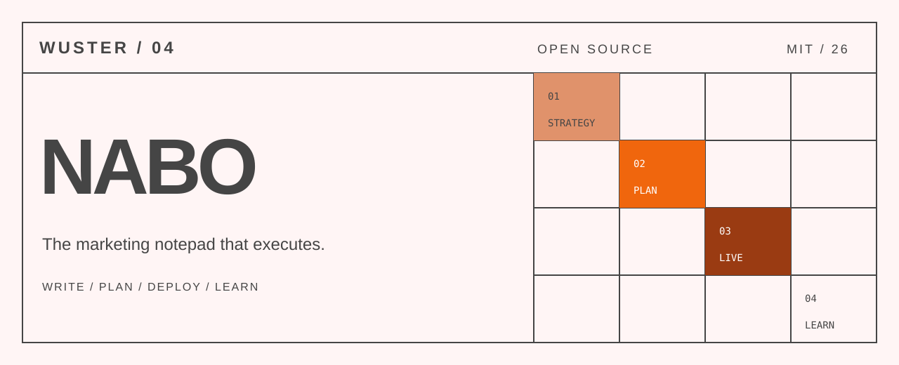
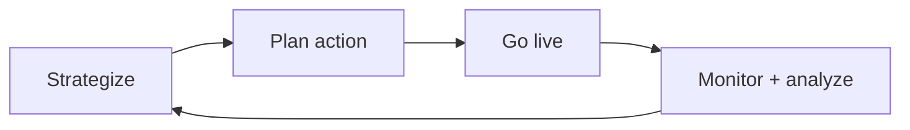

<p align="center">
  
</p>

<p align="center">
  <a href="https://github.com/wusterbuilds/nabo/actions/workflows/ci.yml"></a>
  <a href="LICENSE"></a>
  <a href="CONTRIBUTING.md"></a>
</p>

# Nabo

Nabo is an open-source, executable marketing notebook. A strategist writes the intent once; the note turns it into an action plan, helps configure campaigns, records deployment, analyzes results, and drafts the client update.

AI lives inside the document as an editor and operator—not in a separate chatbot panel.

> **Project status:** interactive prototype. Demo mode is simulated and safe by default. Live advertising actions require an explicit server-side integration.

## The loop



- **Strategize:** turn meeting notes, messages, and observations into a clear objective.
- **Plan action:** generate concrete, reviewable tasks with owners and dependencies.
- **Go live:** configure and deploy through a connected advertising platform.
- **Monitor and analyze:** attribute changes, summarize performance, and draft the client report.

## Run the scripted demo

```bash
git clone https://github.com/wusterbuilds/nabo.git
cd nabo/nabo
npm ci
cp .env.example .env.local
npm run dev
```

Open `http://localhost:3000`, choose **Summit Home Services**, and create the audience-exclusion note. The preloaded journey demonstrates inline AI, planning, simulated deployment, monitoring, and reporting without touching a live ad account.

## Optional integrations

| Variable | Purpose |
| --- | --- |
| `ANTHROPIC_API_KEY` | Generates freeform AI blocks inside notes |
| `PIPEBOARD_MCP_TOKEN` | Connects the optional Meta Ads MCP integration |
| `META_AD_ACCOUNT_ID` | Selects the Meta Ads account used by live actions |

Keep integrations disabled while exploring the product. Live mode can create or modify external advertising resources and should only be used with a test account and explicit authorization.

## Design principles

- The note is the interface; AI output remains editable and contextual.
- Clients behave like folders, preserving a familiar spatial model.
- Every deployment step is reviewable before execution.
- The complete strategy-to-results loop stays attached to one durable artifact.
- Demo organizations, people, metrics, domains, and conversations are synthetic.

## Development

```bash
cd nabo
npm run lint
npm run build
```

See [CONTRIBUTING.md](CONTRIBUTING.md) and [SECURITY.md](SECURITY.md).

## License

MIT. See [LICENSE](LICENSE).
